 

    

 
 
 

# LAB 4: DevOps with Classic Pipelines

## 1. Introduction

In this lab you will create a pipeline to automate the test and deploy process to your Red Hat OpenShift cluster. You will create a pipeline inside IBM Cloud and configure the it to deploy the same Flask application deployed in the provious labs.

## 2. Create a toolchain in IBM Cloud

In your IBM Cloud account access your cluster panel and click in `DevOps` link located in the left side of the screen as shown in the image below.

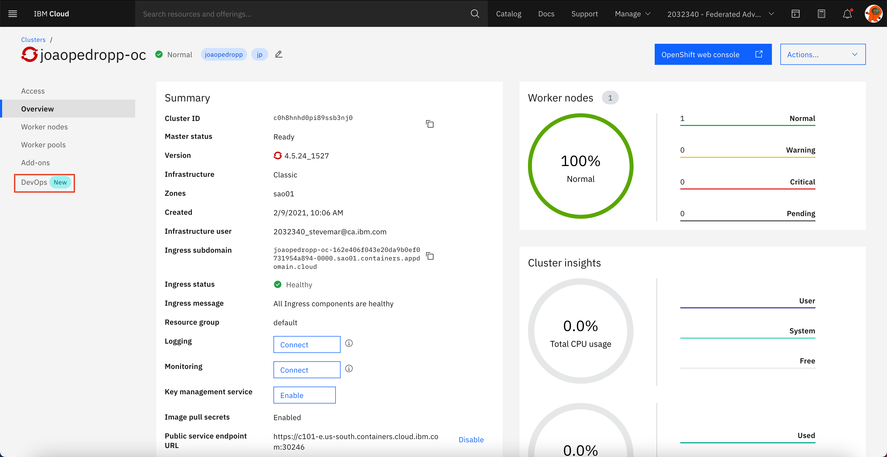

The page loaded has all the toolchains that deploy some application to the selected cluster. To create a new toolchain just click in the `Create toolchain` button locared in the top rigth coner as displayed in the image below.

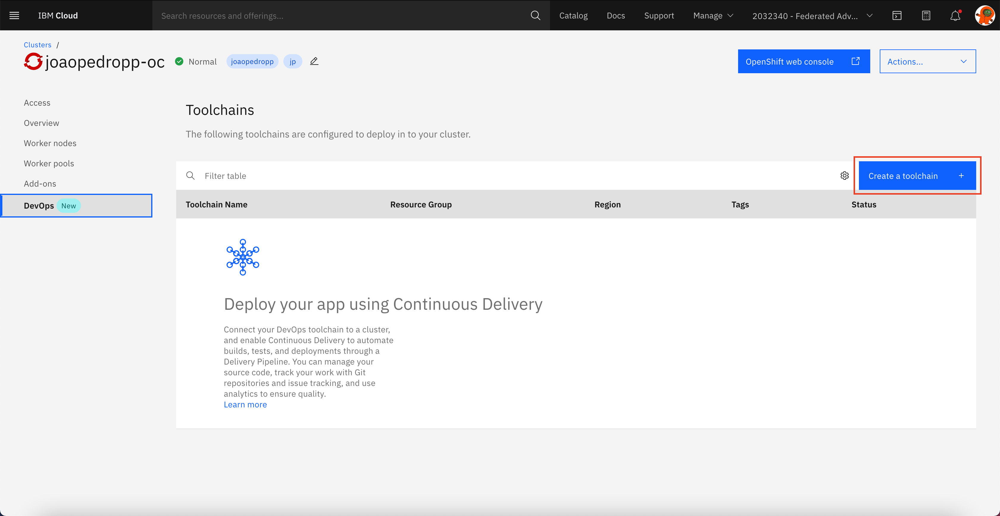

Once you clicked, should appear the catalog of toolchains. There you will find options of pipeline of deployment with many diferent features, for now you will use `Develop a Kubernetes app` as you can se below.

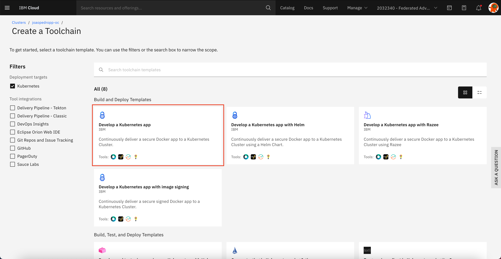

Now you are at configuration form the toolchain. It is important you select the provider of the code as `GitHub` keep the pipeline type as `Classic`. If you are fulfilling this form for the firt time, the platform will ask your athorization to perform github operation like clone the repo. The source repository URL show be: `https://github.com/rhos-devadvo-br/pymongo-demo.git`

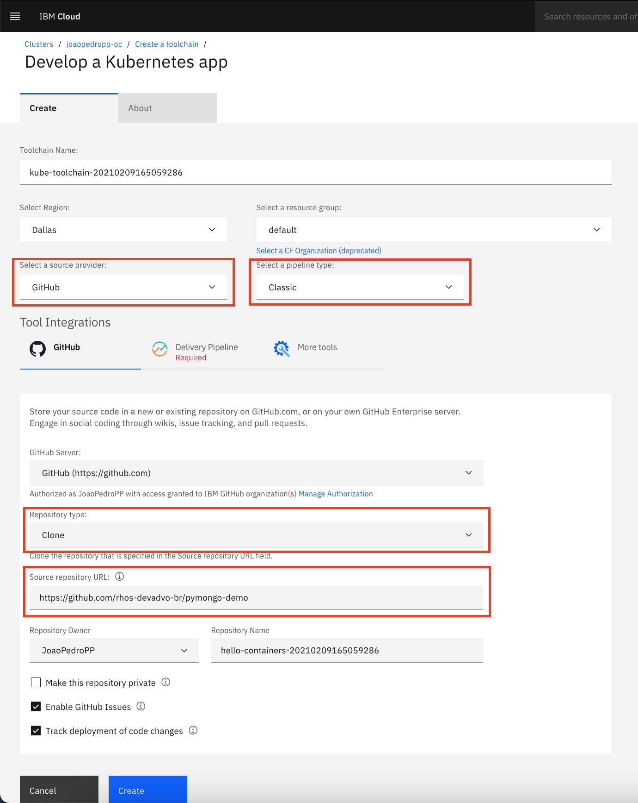

After fulfill the github section you must complete the `Delivery Pipeline` section. You have to create a new `APIKEY` by clicking in `New` button and then make sure the target is the correct cluster. With all the form correct just hit the `Create` button as shown in the image below.

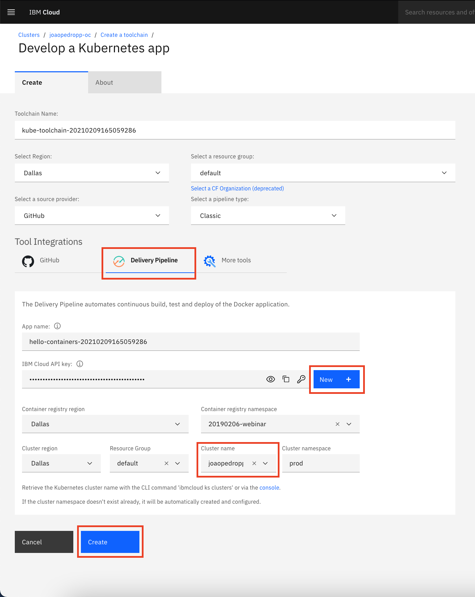

You shall see all card that compose the toolchain. The integration with GitHub and the delivery pipeline. To watch the deployment steps just click over the `Delivery Pipeline` card as displayed in the image below.

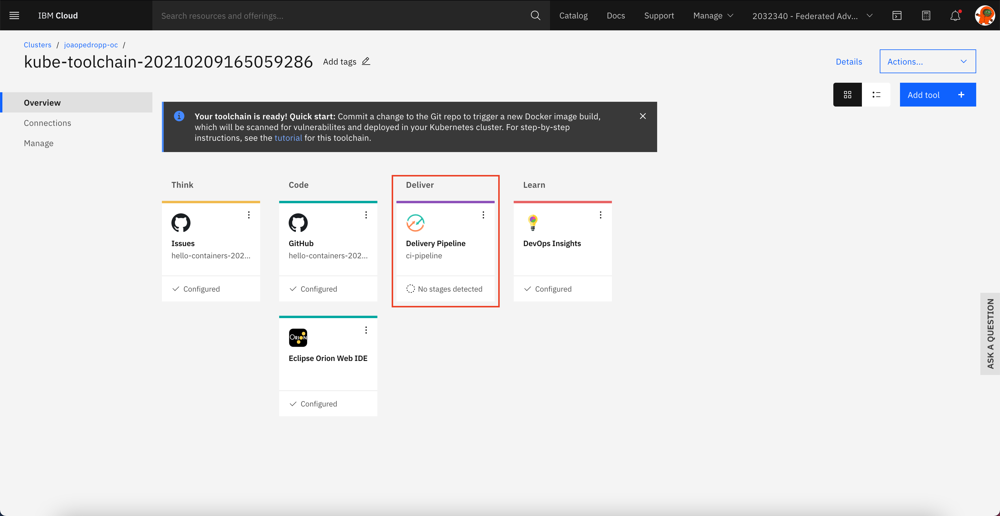

Now you can see all the stages of the deployment process. Firts clone the original repository to you GutHub account, then start to build the application imagem and finally deploy the image in the cluster. These cards are the base. In time, when you get more skilled you can add other cards to test the app in a diferent environment and certify the app, but for now you know how to the basics.

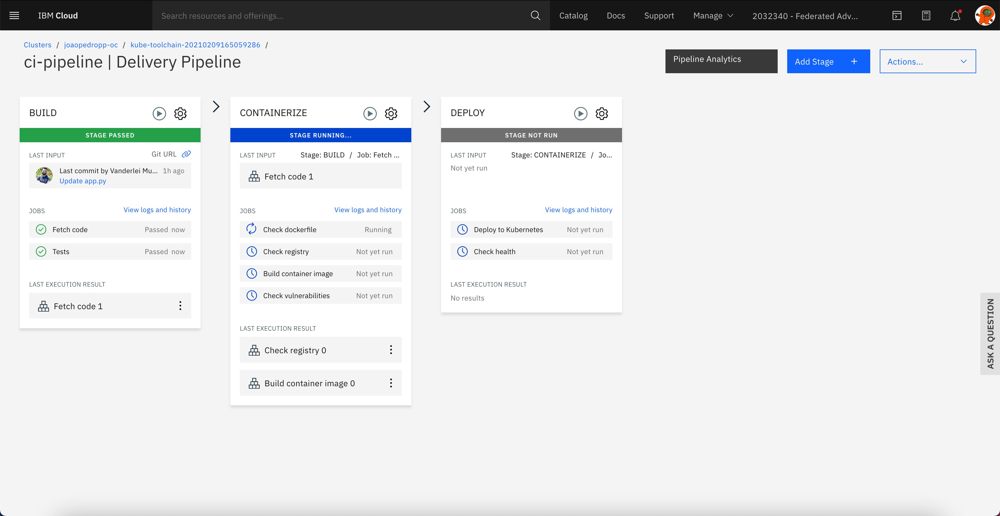

When the process finish you will see all the cards with a green tab over the card like the image below.

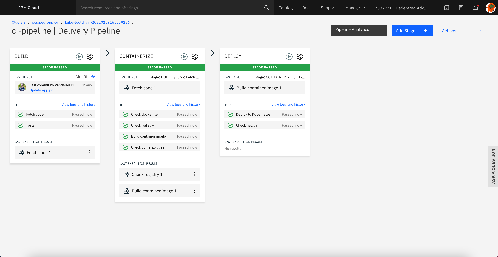

To see your application running, as you have seen before, access you cluster and select the same project you have created during the `Delivery Pipeline` section. Here it is.

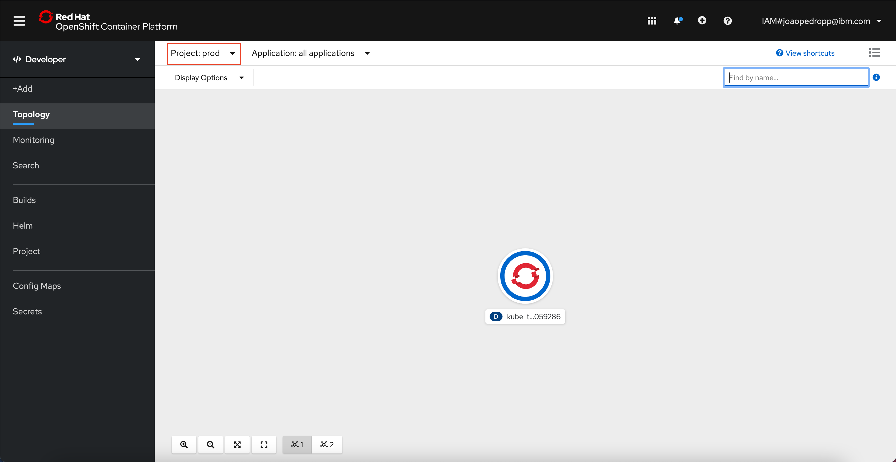

To make your app accesible from your internet browser you have to change the view to admin and select the `Network` tab, then click on `Routes`.

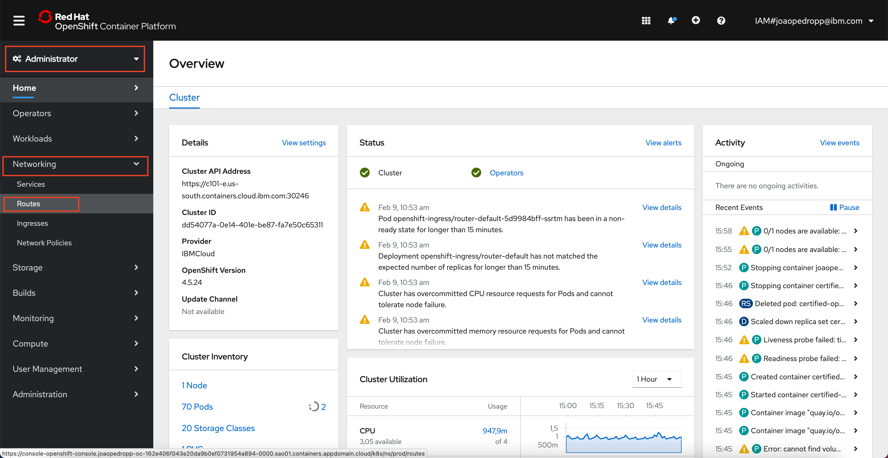

On the top right coner hit the `Create Route` button.

In the form give a name to the route, select the service of your application and then the target port to be released and finally click on `Create` button.

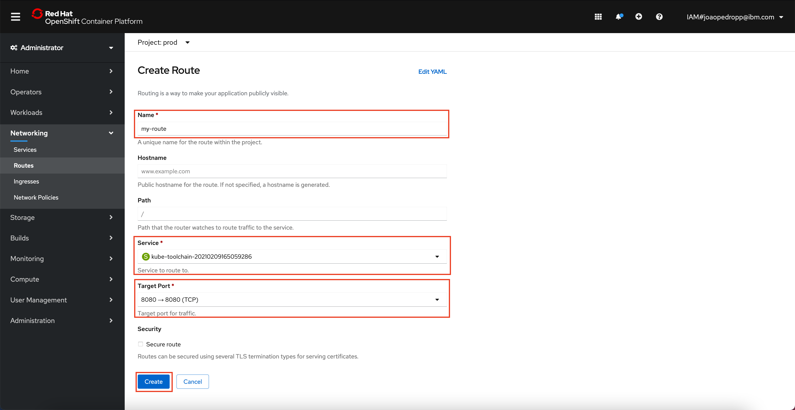

Once you did that return to the Developer view and hit the link button on the app visualization.

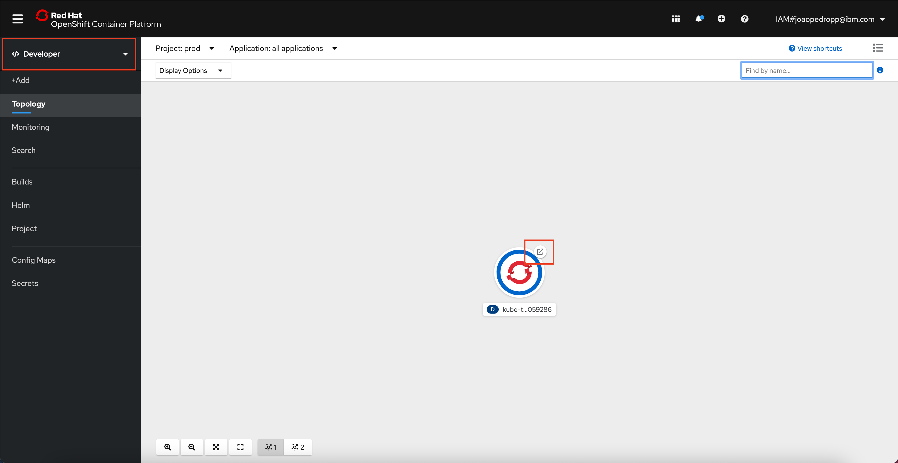

And now you have complete the lab.

[Go to LAB 3: DevOps with OpenShift source-to-image (s2i) and GitHub webhooks](./lab-3.md)

[Go to LAB 5: OpenShift Pipelines](./lab-5.md)
